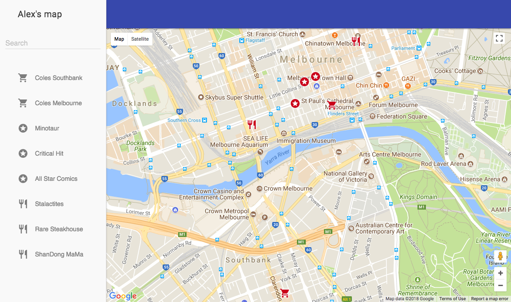

# Udacity Neighbourhood Map
Neighbourhood map project for Udacity

## Dependencies, build and run process 
This project requers several packages that can be installed using npm (or yarn).
```
npm install
```

You can build this project in 'developers' mode, which is better for debugging:
```
npm run build:dev
```

Or in 'production' mode, which is better for consumer facing server:
```
npm run build:prod
```

Your can run developer's server using following command:
```
npm run serve
```

For production any static web server should work, use nginx, apache2 or other.

## Additional information
Project use this libraries, frameworks and apis:
- Knockout.js
- Material Design Light
- Material Icons
- Webpack as build system
- Google Maps API
- Foursquare API

Most of the vendor code shipped from CDN. Project JS and CSS bundled, compiled to ES2015 and minimized.

Live version of the project available here using GitHub pages:
https://alexuslab.com/udacity-neighbourhood-map/

